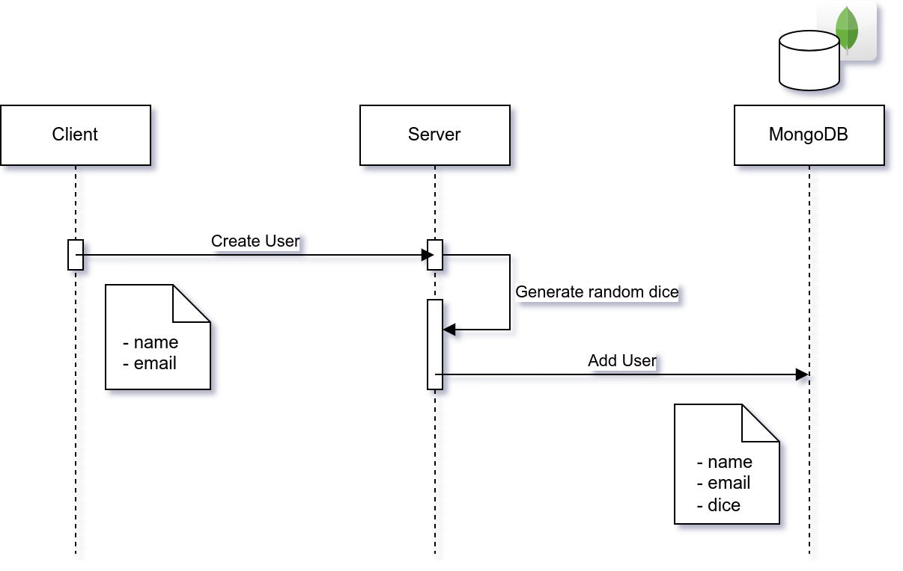

# DevContainers + FastAPI + MongoDB

Microsoft Dev Containers allow you to create isolated development environments, which makes it easier to develop and collaborate, without worrying about compatibility issues.

In this template, we have two services:

- The main application, which is developed in Python using FastAPI framework.
- The database with which the main application will communicate.

Here, both the Python service and the dababase are containerized, using the help of a docker-compose file. This emulates a scenario where the user can comfortably do <code>docker-compose up</code>, and launch the whole app with all its dependencies.

## What does the app do?

The application that I have developed for the demo is a simple **CRUD** in which three components are involved: the client, the server and the database.

For the server, we are using [FastAPI](https://fastapi.tiangolo.com/), a high performance framework for Python; for the database, we are using [MongoDB](https://www.mongodb.com).

The objective of the app is to save users together with a dice number for an online card game. User data, such as name and e-mail, will be saved, along with a dice that is assigned randomly each time we create a user.

The sequence diagram of the *Create User* operation looks like this:



## Deploying the app, locally

In order to get this app up and running, we need to deploy the two services.

We can deploy both services with a simple ```docker-compose``` command:
```
$ docker-compose up -d
```

This will deploy both the MongoDB database and the Python service.

## Deploying the app, using Dev Containers extension

In order to get this app up and running, we can just open the environment inside a Development Container, and it will automatically start both services for us. Then, it will connect us to the main service, that we are developing, which is the Python one.

To do this, use the Dev Container extension shortcut: ```Open Folder in Container```. If you have opened this workspace before, you can click on the extension ```Reopen in Container```, which will remember your container.

Once inside the container, the dependencies must be installed due to the ```RUN pip install -r requirements.txt``` command inside the main service Dockerfile. Here, we don't need a Python virtual environment, since we are currently in one!
